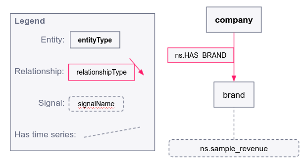

# Sample project for CSV uploads to the Exabel platform

This project contains sample scripts for data ingestion of sample data to
the Exabel platform.

All files will have documentation on how to run them. You will need
to install `exabel-data-sdk` in your Python environment.
PyPi: https://pypi.org/project/exabel-data-sdk/

## Data model

The data model implemented in this project can be visualized as follows:



## Installation

For easy installation of all dependencies, run the following commands in the root directory of the project:

```sh
# Install pipenv
pip install pipenv
# Install dependencies to virtual environment
pipenv install
# Start virtual environment
pipenv shell
```

## Scripts

Documentation on how to run the scripts is found below. Before running any of the scripts, replace the values
of `EXABEL_API_KEY` and `EXABEL_NAMESPACE` in the `upload_data.sh` / `upload_data.ps1` file with the API key and namespace you have been provided by Exabel.

In a production environment, you will want to store the API key in a secure location and load it to the environment variables before execution.

The sample scripts are provided in the `scripts` directory in two versions. `scripts/sh` and `scripts/ps1`.
On Linux and MacOS use the `.sh` files, and on Windows, use the `.ps1` files.

On windows, you can run the scripts with the following command:
```ps1
powershell.exe .\scripts\ps1\<script>.ps1
```

And on Linux and MacOS:
```sh
./scripts/sh/<script>.sh
```

### `upload_data.ps1` / `upload_data.sh`

This script uploads the following to the Exabel platform:

1. the brands in `resources/data/entities/brands.csv`
2. the relationships in `resources/data/relationships/HAS_BRAND.csv`
3. the time series data points in `resources/data/time_series/brand_time_series.csv`
4. the time series data points in `resources/data/time_series/brand_time_series_one_day.csv`.
   This example shows how the usual daily/weekly/monthly incremental load can be performed with the current time set as known time.

The script can also be run "line by line" by running each line in the root directory of the project.

> **Note:**
There are multiple ways of uploading point-in-time accurate data, the sample upload scripts also contain
an example of uploading time series with a fixed offset of days. Please see the
[Exabel API documentation](https://doc.exabel.com/api/data/timeseries.html) for more information.

### `delete_data.ps1` / `delete_data.sh`

To delete the resources created, run this script.

## Optional scripts
### create_time_series_data.py

This script creates geometric brownian movement sample data for the brands in `resources/data/entities/brands.csv`.

Usage:
```sh
# In the root directory of the project
python scripts/py/create_time_series_data.py
```

# Useful Links

* [Exabel Data SDK on PyPI](https://pypi.org/project/exabel-data-sdk/)
* [Exabel Data SDK on GitHub](https://github.com/Exabel/python-sdk)
* [Exabel Data API documentation](https://doc.exabel.com/api/data/)
